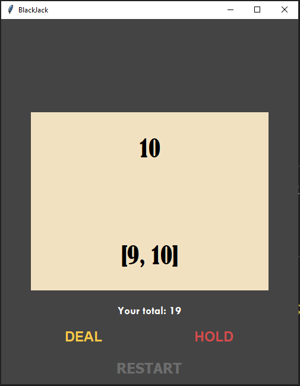
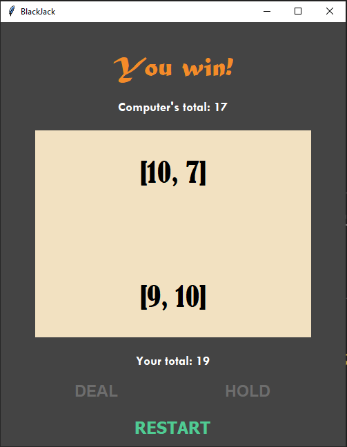
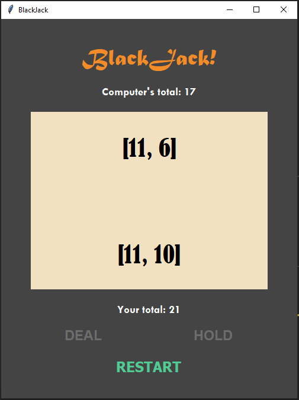
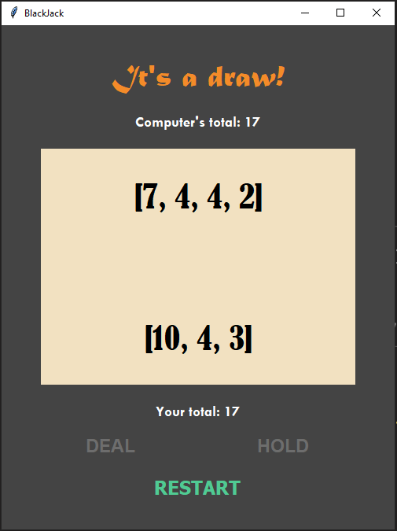

# BlackJack
A simple BlackJack Game

### Written in python 3.9 

## Installation on Windows:
* `git clone https://github.com/snehangsude/BlackJack.git`
* `cd BlackJack`
* `python main.py`

## Installation on Linux and Unix like OS:
* `git clone https://github.com/snehangsude/BlackJack.git`
* `cd BlackJack`
* `python3 main.py`

## Interface Images
* Inital screen

* Win Screen without any <b>DEAL</b>

* Screen if anyone receives a <b>BlackJack</b> 

* Screen after <b>DEAL</b> & <b>HOLD</b>

## How to use

* Run the application using the Installation section
* Choose to <b>DEAL</b> or <b>HOLD</b> based on your hand 
* Based on your or the Computer's hand - the result wil be shown
* Pressing the <b>Restart</b> button would restart the game

## Rules (Know what to expect from the game)

* The deck is unlimited in size. 
* The cards in the list have equal probability of being drawn.
* Cards are not removed from the deck as they are drawn.
* The Jack/Queen/King all count as 10.
* The the Ace can count as 11 or 1.

### Improvements planned

* Plans to improve the aesthetic of the Canvas
* Plans to use other features such as Bidding, Double, Split, Insurance
